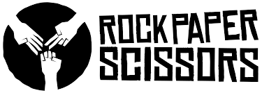

<a name="readme-top"></a>

<div align="center">
  
  <br/>

  <h3><b>Rock, Scisors, Paper</b></h3>

</div>

<!-- TABLE OF CONTENTS -->

# 📗 Table of Contents

- [📖 About the Project](#about-project)
  - [🛠 Built With](#built-with)
    - [Tech Stack](#tech-stack)
    - [Key Features](#key-features)
  - [🚀 Live Demo](#live-demo)
- [💻 Getting Started](#getting-started)
  - [Setup](#setup)
  - [Prerequisites](#prerequisites)
  - [Usage](#usage)
- [👥 Authors](#authors)
- [🤝 Contributing](#contributing)
- [⭐️ Show your support](#support)
- [🙏 Acknowledgements](#acknowledgements)
- [📝 License](#license)

<!-- PROJECT DESCRIPTION -->

# 📖 Rock, Scisors, Paper <a name="about-project"></a>

**Rock, Scisors, Paper** is a virtual game based on the popular game [Rock, Scisors, Paper](https://en.wikipedia.org/wiki/Rock_paper_scissors).

## 🛠 Built With <a name="built-with"></a>

### Tech Stack <a name="tech-stack"></a>

<details>
  <summary>Client</summary>
  <ul>
    <li>HTML</li>
    <li>CSS</li>
    <li>JavaScript</li>
  </ul>
</details>

<!-- Features -->

### Key Features <a name="key-features"></a>

- HTML, CSS, Javascript
- Github pages

<p align="right">(<a href="#readme-top">back to top</a>)</p>

<!-- LIVE DEMO -->

## 🚀 Live Demo <a name="live-demo"></a>

- [Play the game](https://rock-scisors-paper.netlify.app/)

<p align="right">(<a href="#readme-top">back to top</a>)</p>

<!-- GETTING STARTED -->

## 💻 Getting Started <a name="getting-started"></a>

To get a local copy up and running, follow these steps.

### Prerequisites

In order to run this project you need:

- A web browser

### Setup

Clone this repository to your desired folder:

<!--
Example commands:
```sh
  cd my-folder
  git clone git@github.com:franclobo/Project-Rock-Paper-Scissors.git
```
--->

### Usage

Open the index.html file in your browser.


<p align="right">(<a href="#readme-top">back to top</a>)</p>

<!-- AUTHORS -->

## 👥 Authors <a name="authors"></a>

> Mention all of the collaborators of this project.
👤 **Francisco Borja**

- GitHub: [franclobo](https://github.com/franclobo)
- Twitter: [@Pancho2788]https://twitter.com/Pancho2788)
- LinkedIn: [francisco-borja-lobato](https://www.linkedin.com/in/francisco-borja-lobato/)

<p align="right">(<a href="#readme-top">back to top</a>)</p>

<!-- CONTRIBUTING -->

## 🤝 Contributing <a name="contributing"></a>

Contributions, issues, and feature requests are welcome!

Feel free to check the [issues page](../../issues/).

<p align="right">(<a href="#readme-top">back to top</a>)</p>

<!-- SUPPORT -->

## ⭐️ Show your support <a name="support"></a>

> Write a message to encourage readers to support your project
If you like this project please give it a ⭐️!

<p align="right">(<a href="#readme-top">back to top</a>)</p>

<!-- ACKNOWLEDGEMENTS -->

## 🙏 Acknowledgments <a name="acknowledgements"></a>

> Give credit to everyone who inspired your codebase.
I would like to thank [The Odin Project](https://www.theodinproject.com/lessons/foundations-rock-paper-scissors) for the inspiration and the project idea.

<p align="right">(<a href="#readme-top">back to top</a>)</p>

<!-- LICENSE -->

## 📝 License <a name="license"></a>

This project is [MIT](./LICENSE) licensed.

<p align="right">(<a href="#readme-top">back to top</a>)</p>
